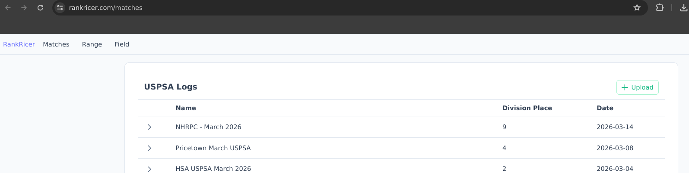
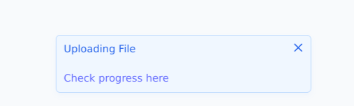
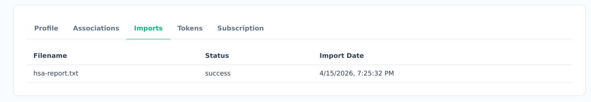

# Hit Factor

To upload your USPSA data, go to [RankRicer Matches](https://www.rankricer.com/matches).

You will see an "Upload" button on the top right. Clicking this will pop up your file explorer.
Look for the file you downloaded from practiscore.

After selecting the file. You will see this indicator in the bottom of the page.

It should take under a minute to upload the file.

If you click on the "Check progress here", you will see this page.

When the status says "success", your file has been completely uploaded.
When you go back to the [Matches](https://www.rankricer.com/matches) page you will see the uploaded item in the logs table.
You will also see your data visualized in the [home page](https://www.rankricer.com).

To upload your SCSA data, follow the same steps above.
