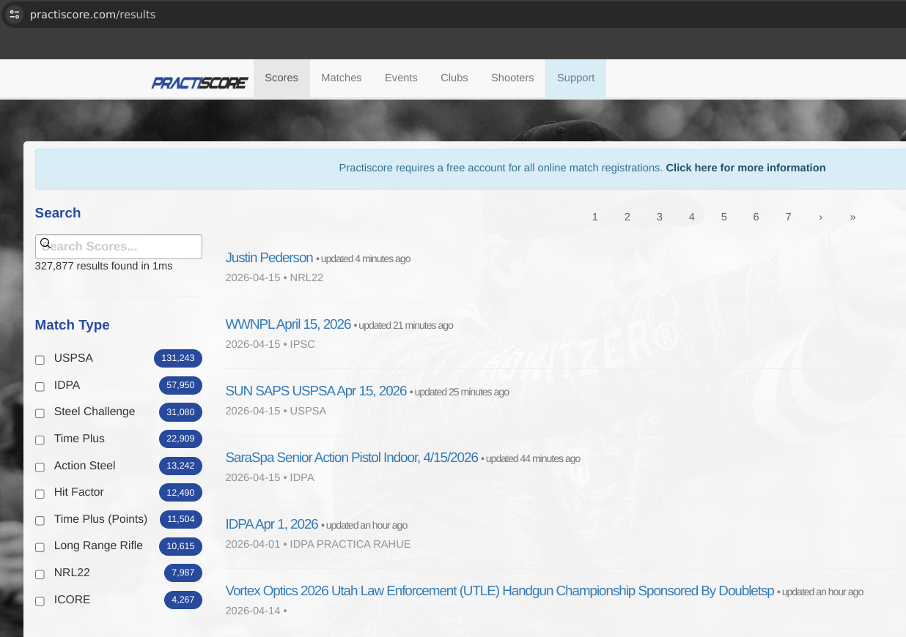
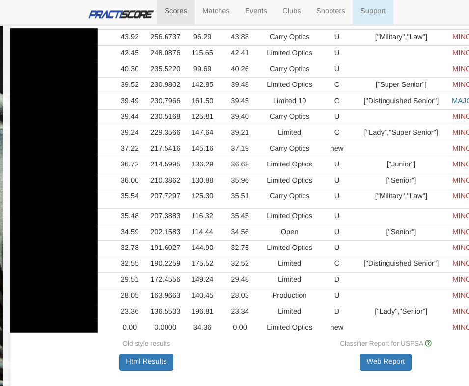
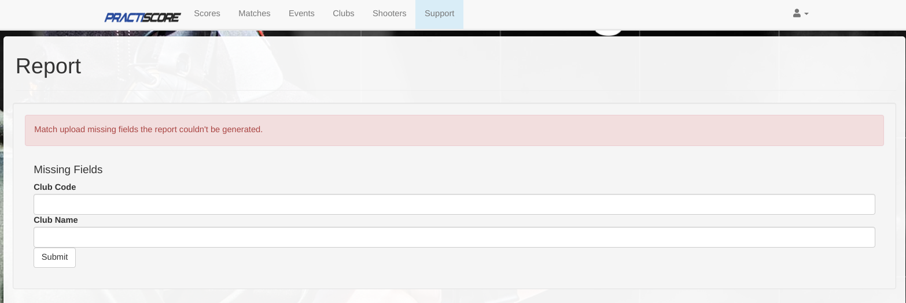
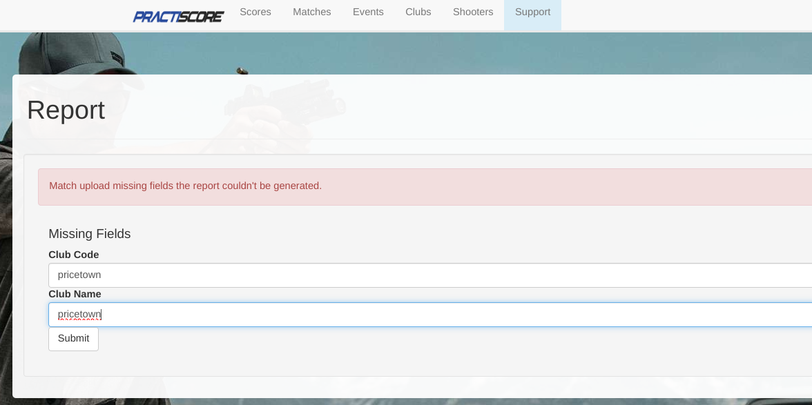

# Practiscore

Download your USPSA data from [practiscore](https://practiscore.com/results).
Search for your USPSA match by using the input box on the top left.

When you find your match, navigate to it. It will take you to this page.

In the bottom of the page you will see "Web Report". Navigate to it.

It will take you to this page.

It will ask you for either "Club Code" or "Club Name" but sometimes it will ask
for both like the screenshot above. Club Code and Club Name are usually the name of the club.
For example in the match named "Pricetown USPSA Apr 12, 2026", the club code and club name would be "pricetown".
If this doesn't work, feel free to reach out to the match director and ask for this information.

After filling in the required inputs, click "Submit". This will download a file. By default, it is named "report.txt".

